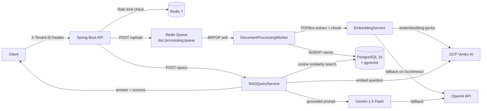

# doc-intelligence-api

**A production-ready, multi-tenant document intelligence platform for enterprise consulting engagements.**
Upload PDFs, contracts, and invoices — the system chunks, embeds, and indexes them using GCP Vertex AI.
Users then query in plain English and receive grounded, context-aware answers backed by a RAG pipeline
with pgvector semantic search. Designed as a billable starter kit: the architecture is explainable in
a whiteboard session, every dependency is justified, and the codebase is structured to survive a
Fortune 500 security and architecture review.

---

## Architecture



---

## Quickstart

### Prerequisites
- Docker + Docker Compose
- A GCP project with Vertex AI API enabled and a service account JSON key
- (Optional) An OpenAI API key for fallback

### 1. Clone and configure

```bash
git clone https://github.com/your-org/doc-intelligence-api.git
cd doc-intelligence-api
cp .env.example .env
# Edit .env with your credentials
```

### 2. Build and run

```bash
mvn clean package -DskipTests
docker-compose up --build
```

The API will be available at `http://localhost:8080` within ~30 seconds.

### 3. Verify health

```bash
curl http://localhost:8080/health
```

---

## Configuration Reference

| Variable | Required | Default | Description |
|---|---|---|---|
| `DB_PASSWORD` | Yes | — | PostgreSQL password |
| `GCP_PROJECT_ID` | Yes | — | GCP project ID for Vertex AI |
| `GCP_LOCATION` | No | `us-central1` | Vertex AI region |
| `GOOGLE_APPLICATION_CREDENTIALS_HOST_PATH` | Yes | — | Host path to GCP service account JSON |
| `OPENAI_API_KEY` | No | — | OpenAI key for LLM fallback |
| `REDIS_PASSWORD` | No | (empty) | Redis auth password |
| `DB_NAME` | No | `docintellect` | PostgreSQL database name |
| `DB_USER` | No | `docintellect` | PostgreSQL username |

### Rate Limit Tiers (application.yml)

| Tier | Requests / Minute |
|---|---|
| FREE | 20 |
| PRO | 200 |
| ENTERPRISE | 2000 |

---

## API Reference

### Tenant Onboarding

Registers a new tenant and provisions an isolated PostgreSQL schema.

```bash
curl -X POST http://localhost:8080/api/v1/tenants \
  -H "Content-Type: application/json" \
  -d '{
    "tenantId": "acme",
    "name": "Acme Legal",
    "tier": "PRO"
  }'
```

**Response:**
```json
{
  "tenantId": "acme",
  "schemaName": "tenant_acme",
  "tier": "PRO",
  "createdAt": "2025-01-15T10:00:00Z"
}
```

---

### Document Upload

Upload a PDF for async processing. Returns a `jobId` for status polling.

```bash
curl -X POST http://localhost:8080/api/v1/documents/upload \
  -H "X-Tenant-ID: acme" \
  -F "file=@/path/to/contract.pdf"
```

**Response (202 Accepted):**
```json
{
  "jobId": "f47ac10b-58cc-4372-a567-0e02b2c3d479",
  "documentId": "550e8400-e29b-41d4-a716-446655440000",
  "filename": "contract.pdf",
  "status": "QUEUED",
  "tenantId": "acme",
  "submittedAt": "2025-01-15T10:01:00Z"
}
```

---

### Job Status Polling

```bash
curl http://localhost:8080/api/v1/documents/f47ac10b-58cc-4372-a567-0e02b2c3d479/status \
  -H "X-Tenant-ID: acme"
```

**Response (COMPLETED):**
```json
{
  "jobId": "f47ac10b-58cc-4372-a567-0e02b2c3d479",
  "status": "COMPLETED",
  "filename": "contract.pdf",
  "chunkCount": 42,
  "tenantId": "acme",
  "updatedAt": "2025-01-15T10:01:45Z"
}
```

---

### Natural Language Query

Query across all ingested documents for this tenant.

```bash
curl -X POST http://localhost:8080/api/v1/query \
  -H "X-Tenant-ID: acme" \
  -H "Content-Type: application/json" \
  -d '{
    "question": "What are the payment terms in the MSA?",
    "topK": 5
  }'
```

**Response:**
```json
{
  "answer": "Per Section 4.2 of the MSA, payment is due net-30 from invoice date...",
  "sourceDocuments": [
    {
      "documentId": "550e8400-e29b-41d4-a716-446655440000",
      "filename": "contract.pdf",
      "chunkText": "Section 4.2: Payment Terms. All invoices are due and payable...",
      "similarityScore": 0.934,
      "chunkIndex": 12
    }
  ],
  "model": "gemini-1.5-flash",
  "latencyMs": 1240,
  "tenantId": "acme",
  "grounded": true
}
```

If the uploaded documents do not contain sufficient context (cosine similarity below `0.75`),
the API returns `grounded: false` and does not hallucinate.

---

### Operational Metrics

```bash
curl http://localhost:8080/metrics
```

Returns: documents ingested, queries served, average RAG latency, embedding model in use, and queue depth.

---

## Multi-Tenancy Design

Each tenant receives a dedicated PostgreSQL schema (`tenant_{id}`) provisioned on registration.
All `documents`, `chunks`, and `embeddings` tables live within this schema.
A `TenantResolutionFilter` reads the `X-Tenant-ID` header on every request, validates the tenant
against the `public.tenants` master table, and populates a `TenantContext` ThreadLocal.
A `TenantAwareJdbcTemplate` wrapper issues `SET search_path TO tenant_{id}, public` before
every query, ensuring zero cross-tenant data leakage at the database layer.

---

## Roadmap — v0.2 and Beyond

1. **Webhook callbacks on job completion** — POST a configurable URL when ingestion reaches
   COMPLETED or FAILED, with HMAC-signed payloads for security.

2. **Document access control per tenant user** — Sub-tenant user roles (owner, viewer, auditor)
   with row-level policies on the `documents` table and JWT-based authentication.

3. **Streaming SSE query responses** — Stream Gemini token-by-token output via Server-Sent Events
   (`text/event-stream`) so UIs can render answers progressively.

4. **Cost tracking per tenant by token usage** — Instrument every LLM call with input/output
   token counts, persist to a `usage_events` table, and expose a `/api/v1/usage` summary
   endpoint for chargeback reporting.

---

## License

MIT — use freely as a consulting starter kit. Attribution appreciated.
